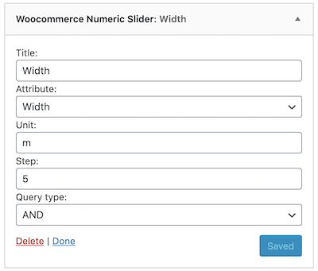
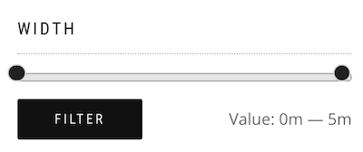

# Woocommerce Numeric Slider

This repository contains a **Wordpress plugin**, which is a simple widget to filter **Woocommerce** products by a numeric attribute using a slider.

_What does it mean?_\
When you are working with Woocommerce, you can define some product's _attributes_ and their associated _values_. These values are always stored as _text_, even though they could be _numeric_ types (`int` or `float`). This kind of storage issue makes it difficult to filter products by an attribute, when its values are all numeric. To solve this issue, this plugin provides a simple widget (just like the Woocommerce default ones), which can be used to address this problem.

## Installation

1. [Download the plugin](https://github.com/Wadaboa/woo-num-slider/archive/master.zip) from the provided link or from the _Releases_ page
2. Upload the plugin to `/wp-content/plugins/` or use the WordPress plugin uploader
3. Activate the plugin

## Usage

To use the widget, open your Wordpress admin page, go to **Aspect**, then **Widgets**. Here you have to find the **Woocommerce Numeric Slider** widget and add it to the area of your choice (usually the shop sidebar). Once you added the widget, you will be prompted by this kind of interface:

In here, you have to select the attribute you want to use to filter the products and you can also give a name to the widget, which will appear on top of the slider on your website. Once you saved your edits to the **Woocommerce Numeric Slider** widget, you can visit your website and you should find a filter like the following:

## Features

- It lets you filter Woocommerce products by a numeric attribute, using a `from` - `to` slider
- It lets you choose the attribute you want to filter with on the widget page (no need to get you hands dirty with code)
- It uses the same styles as the **Filter Products by Price** Woocommerce widget, so it should be compatible with most available themes (FYI, the slider has been extensively tested with the **ShopIsle** theme)
- You can include more than one filter on the same page to filter by different attributes

**NOTE**: If you want to filter products using more than one `Woocommerce Numeric Slider`, consider the `Query type` option in the widgets configuration. By setting the option to `OR` for each and every widget, you'll obtain a disjunctive query, while setting the option to `AND` (the default value) will give a conjunctive result.

## References

My inspiration comes from the following resources:

- [`WooCommerce Attribute Range Filter`](https://github.com/anttiviljami/woocommerce-attribute-range-filter)
- [`Filter Products by Price`](https://github.com/woocommerce/woocommerce/blob/master/includes/widgets/class-wc-widget-price-filter.php)
